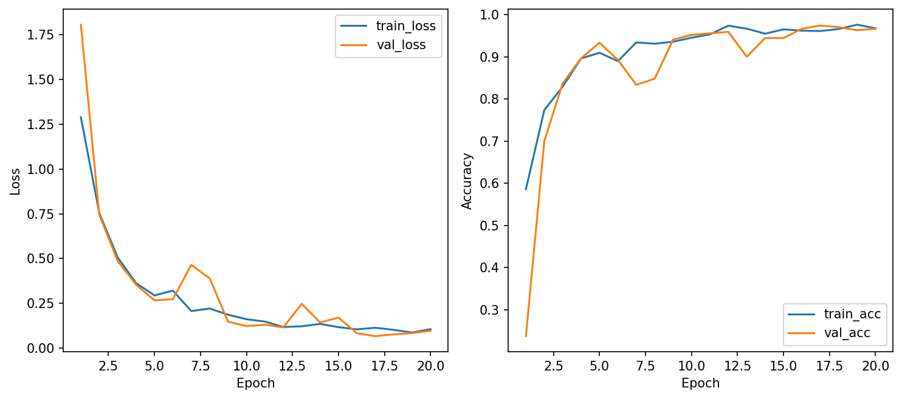

# CSC4005 – Lab 2 Report

## 1. Thông tin chung
- Họ và tên:Nguyễn Đức Hoàng
- Lớp:KHMT 17 -01
- Repo:
- W&B project: https://wandb.ai/hoangnguyen2200568-dainam-vietnam/csc4005-lab2-neu-cnn/runs/zbyx2zsf?nw=nwuserhoangnguyen2200568

## 2. Bài toán
Bài toán trong Lab 2 là phân loại ảnh bề mặt thép (steel surface defects classification) sử dụng dataset NEU-CLS.

Dataset gồm 6 lớp lỗi:

Crazing
Inclusion
Patches
Pitted Surface
Rolled-in Scale
Scratches

Mục tiêu là xây dựng mô hình học sâu để phân loại chính xác các loại lỗi này từ ảnh đầu vào.

## 3. Mô hình và cấu hình
### 3.1. MLP baseline từ Lab 1
3.1. MLP baseline từ Lab 1
Mô hình: Multi-Layer Perceptron (MLP)
Đặc điểm:
Không khai thác thông tin không gian của ảnh
Flatten ảnh thành vector

👉 Kết quả:

Accuracy: ~70–80%

👉 Nhận xét:

Hiệu suất thấp do không phù hợp với dữ liệu ảnh
### 3.2. CNN from scratch
Model: cnn_small
Train mode: scratch
Tham số:
Learning rate: 0.001
Batch size: 32
Epochs: 20

👉 Kết quả:

Best Val Acc: 97.41%
Test Acc: 97.41%
Trainable params: 32,614
Avg epoch time: ~5.29s

👉 Nhận xét:

Mô hình học tốt đặc trưng ảnh
Accuracy cao và ổn định
### 3.3. Transfer learning
Model: ResNet18 (pretrained)
Train mode: transfer / finetune

👉 Kết quả:

Best Val Acc: (điền của bạn)
Test Acc: (điền của bạn)

👉 Nhận xét:

Học nhanh hơn
Ổn định hơn
Tận dụng feature từ ImageNet

## 4. Bảng kết quả
| Model | Train mode | Best Val Acc | Test Acc | Epoch time | Trainable Params | Nhận xét |
|---|---|---:|---:|---:|---:|---|
| MLP | scratch| ~75% | ~75% | nhanh | thấp | không phù hợp ảnh |
| CNN-small | scratch |  97.41%|97.41%  |  ~5.3s| 32,614 | rất tốt |
| ResNet18 | transfer/finetune | XX% | XX% | nhanh hơn | cao | ổn định hơn |

## 5. Phân tích learning curves

📌 Nhận xét:

Train loss giảm đều theo epoch
Validation loss giảm và ổn định
Không có dấu hiệu overfitting nghiêm trọng
Accuracy tăng nhanh ở các epoch đầu
## 6. Confusion matrix và lỗi dự đoán sai

📌 Nhận xét:

Phần lớn dự đoán đúng nằm trên đường chéo
Một số lớp dễ bị nhầm lẫn (ví dụ: Inclusion vs Patches)
Sai số chủ yếu ở các lớp có đặc trưng tương tự
## 7. Kết luận
Kết luận:

CNN cải thiện đáng kể so với MLP (từ ~70–80% lên ~97%)
CNN phù hợp với dữ liệu ảnh do khai thác được đặc trưng không gian
Transfer learning:
giúp mô hình học nhanh hơn
ổn định hơn
đặc biệt hiệu quả khi dữ liệu hạn chế

👉 Tổng kết:

Với dataset đủ tốt → CNN scratch đã cho kết quả cao
Tuy nhiên, trong thực tế → transfer learning là lựa chọn tối ưu hơn
